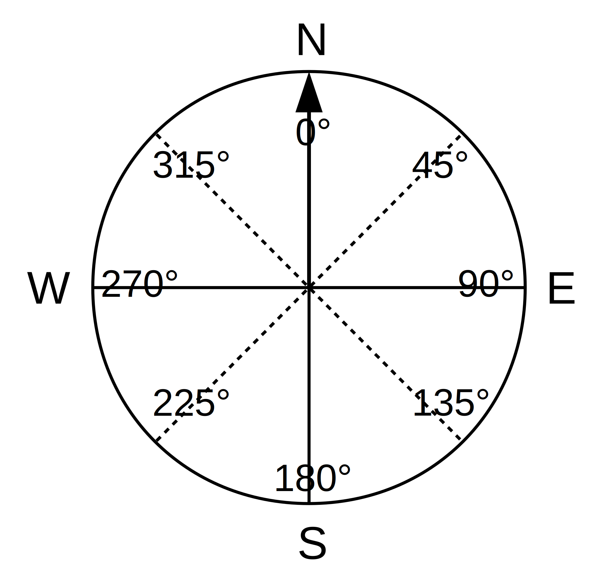

= Fiche 6: Boussole

Niveau: Moyen

== Blocs

* Basique
** Au démarrage
** Lorsque le bouton A est pressé
** Toujours
** Montrer nombre
** Afficher texte
** Montrer la flèche Nord
* Entrée
** Calibrer la boussole
** Direction de la boussole (°)
* Logique
** Si ... alors
** Opérateur <
** Opérateur et
** Opérateur ou
* Variables
** Définir item

== Etape 1: Afficher l'angle

Au démarrage de la carte Micro:bit,
calibrer la boussole.

Calibrer la boussole permet d'initialiser le composant qui mesure l'orientation.
Lorsque la carte  Micro:bit affiche le message "Draw a circle",
il faut tourner la cartedans tous les sens jusqu'à voir apparaître un cercle complet.

Lorsque le bouton 1 est pressé,
lire la direction de la boussole (c'est un angle en degrés),
et afficher ce nombre.

== Etape 2: Afficher le point cardinal

Le Nord correspond à la direction 0°=360°:

[NOTE]
Les forts en math auront remarqué que la boussole suit le sens horaire au lieu du sens trigonométrique.

Lors que la direction de la boussoles est comprise entre 45° et 135°,
afficher E comme Est:

	si (direction > 45) et (direction < 135°) 
	alors afficher texte "E"

Faire de même avec le Nord, l'Ouest et le Sud:

|====
|Nord |N  |de 0°  | à 45° 
|Est  |E  |de 45°  | à 135° 
|Sud  |S  |de 135°  | à 225° 
|Ouest  |O ou W  |de 225°  | à 315° 
|Nord |N  |de 315°  | à 360° 
|====

On pourra dupliquer les blocs pour aller plus vite.

Comment faire pour traiter le cas particulier du Nord plus simplement?

== Etape 3: Pointer le nord

Utiliser le bloc Montre flèche Nord,
pour afficher une flèche qui pointe toujours vers le nord,
comme sur une boussole classique.
