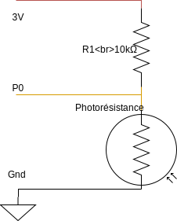

= Fiche 7: Lumière

== Blocs

* Basique
** Toujours
** Montrer LEDs
** Montrer nombre
** Pause (ms)
* Entrées
** température (°C)
* Logique
** Si ... alors ... sinon
** Opérateur >
* Composants (facultatif)
** Résistance 10k&Omega;
** Photo résistance

== Etape 1: Afficher la luminosité

Répéter indéfiniment les instructions suivantes:

. Dessiner une ampoule avec Montrer LEDs (voir un exemple ci-dessous)
. Lire lire l'intensité lumineuse et l'afficher
. Faire un pause d'une &half;s (soit 500ms)

Tester, la différence d'intensité lumineuse en cachant la carte Micro:bit dans une boite ou un sac opaque.

== Etape 2: Jour ou nuit

Compléter les 3 instructions précédentes:

* Si la luminosité > 20, alors dessiner un soleil
* Sinon, si la luminosité &le; 20, alors dessiner une lune

== Etape 3 (Facultatif): Photo résistance

Une photo résistance est un composant qui résiste plus ou moins fortement à l'électricité qui le traverse en fonction de la quantité de lumière à laquelle il est exposé. Jusqu'ici nous avons utilisé celui qui dans la carte Micro:bit. Maintenant nous allons utiliser le notre.

=== Montage

[NOTE]
Les plus forts auront remarqué qu'il s'agit d'un pont diviseur de tension.

=== Programme

Pour lire la luminosité détectée par la photo résistance, utiliser le bloc Lire broche en analogique P0.

Lorsque le bouton B est pressé, afficher le nombre lu en analogique sur la broche P0.

[INFO]
La valeur retournée par le bloc Lire broche en analogique est une valeur comprise entre 0 et 1023.

Exposer le composant à une lumière vive (soleil, lampe), ou bien le mettre dans l'obscurité en le cachant sous quelque chose d'opaque, et observer les valeurs lues.

Afficher, un soleil ou une lune en fonction de l'exposition lumineuse.
