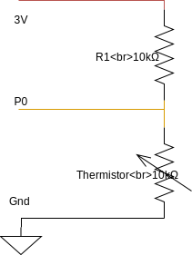

= Fiche 8: Thermomètre

== Blocs

* Basique
** Toujours
** Montrer LEDs
** Montrer nombre
** Pause (ms)
* Entrées
** température (°C)
* Logique
** Si ... alors ... sinon
** Opérateur >
* Composants (facultatif)
** Résistance 10k&Omega;
** Thermistor 10k&Omega;

== Etape 1: Afficher la température

Répéter indéfiniment les instructions suivantes:

. Dessiner un thermomètre avec Montrer LEDs (voir un exemple ci-dessous)
. Lire la température (c'est un nombre en °c) et l'afficher
. Faire un pause d'une &half;s (soit 500ms)

Un thermomètre

    .*...
    .*...
    .*...
    ***..
    .*...

En fonction de la saison et de la météo, on pourra tester, *avec l'aide d'un adulte*, la différence de température entre l'intérieur et l'extérieur.

== Etape 2: Chaud ou froid

Compléter les 3 instructions précédentes:

* Si la température > 15°, alors dessiner un soleil
* Sinon, si la temperature &le; 15°, alors dessiner la pluie ou un nuage

== Etape 3 (Facultatif): Thermistor

Un thermistor ou thermistance est un composant qui résiste plus ou moins fortement à l'électricité qui le traverse en fonction de la température qu'il fait. Jusqu'ici nous avons utilisé celui qui dans la carte Micro:bit. Maintenant nous allons utiliser le notre.

=== Montage

[NOTE]
Les plus forts auront remarqué qu'il s'agit d'un pont diviseur de tension.

=== Programme

Pour lire la température détectée par le thermistor, utiliser le bloc Lire broche en analogique P0.

Lorsque le bouton B est pressé, afficher le nombre lu en analogique sur la broche P0.

[WARNING]
La valeur retournée par le bloc Lire broche en analogique, n'est pas une température. C'est une valeur comprise entre 0 et 1023. On peut déterminer la température en °C à partir de ce nombre avec un calcul compliqué.

Réchauffer le composant avec ses doigts, ou bien le refroidir en soufflant dessus et observer la température mesurée. 
