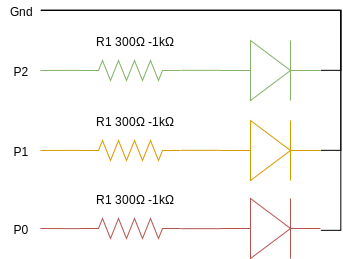

= Fiche 9: Feu tricolore

== Blocs

* Basique:
** Pause
** Montrer nombre
* Entrées
** Lorsque le bouton A est pressé
* Boucles
** Répéter 4 fois
* Radio
** Radio définir groupe 1
** Envoyer le nombre
** Quand une donnée est reçue par radio receivedNumber
* Broches
** Ecrire en numerique la broche P0 à 1
* Composants
** 3 LEDs: Rouge, verte et bleue
** 3 resistances: d'au moins 300&Omega;
** Breadboard et fils

== Etape 1: Piloter une LED

=== La LED ou Diode Eletroluminescente

image:diode-led.svg[Schema diode LED,float="left"]

La diode est un composant polarisé:
pour qu'elle s'allume, il faut connecter la cathode (patte courte = borne -) à la borne Gnd de la carte Microbit,
et l'anode (patte longue = borne +) à la broche P0 (ou P1 ou ..) via une résistance.

WARNING: La diode doit impérativement être protégée par une résistance d'au moins 300&Omega;, sinon elle va griller!

=== Montage

=== Programme

Pour allumer une diode reliée à la broche P0, écrire en numerique 1 sur cette broche. Pour l'éteindre, écrire 0 en numérique sur la broche P0.

Ecrire le programme suivant:
Lorsque le bouton A est pressé, faire clignoter 5 fois la LED.

== Etape 2: Tricolore

=== Montage

Répéter le montage du paragraphe précédent 3 fois:

* P0 gère la LED rouge
* P1 gère la LED jaune/orange
* P2 gère la LED verte

=== Programme

Pour commencer, s'assurer que les 3 LEDs s'allument.

Puis lorsque le bouton A est pressé, enchainer les LEDs comme suite:

[options="header"]
|====
|LED    |Durée
|Rouge  |    4s
|Verte  |    3s
|Orange |    1s
|====

Répeter cet enchaînement 5 fois.

== Etape 3: Carrefour radio

Ce paragraphe doit être fait avec un autre groupe qui aura réalisé la même fiche. Il faut 2 cartes Micro:bit, une carte *maître* qui donne des instructions et une carte *élève* qui les applique.

Au demarrage, configurer sur les 2 cartes pour utiliser le même canal radio.

=== Sur la carte maître

Envoyer par radio à l'autre carte Micro:bit un nombre correspondant à  chacune des étapes:

[options="header"]
|====
|Etape  |LED Maitre   |LED Elève  |Durée
|1      |Rouge        |Vert       |3s
|2      |Rouge        |Orange     |1s
|3      |Vert         |Rouge      |3s
|4      |Orange       |Rouge      |1s
|====

Utiliser le bloc Montre nombre pour afficher le numéro de l'étape.

=== Sur la carte élève

Utiliser le bloc Quand une donnée est reçue par radio, pour recevoir le numéro de l'étape.

Utiliser le bloc Montre nombre pour afficher le numéro de l'étape reçu.

En fonction du numéro de l'étape, allumer l'une ou l'autre des LEDs (voir le tableau au paragraphe précédent)
