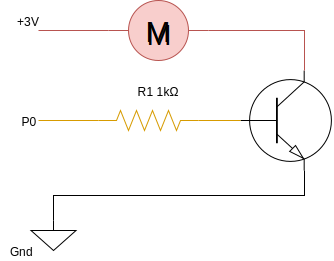

= Fiche 10: Piloter un moteur

Niveau: Moyen

Piloter une moteur à courant continu depuis la carte micro:bit.

== Blocs

* Basique
** Au démarrage
** Toujours
** Montrer nombre
* Entrées
** Lorsque le bouton A est pressé
* Logique
** Si ... alors
** Operateur < et >
* Variables:
** Définir item à 0 (signifie affecter 0 à la variable item)
** Changer item pour 1 (signifie ajouter 1 à la variable item)
* Broches
** Ecrire en analogique la broche P0
* Composants
** Moteur DC
** Résistance d'environ 1k&Omega;: Marron/Noir/Rouge, Rouge/Rouge/rouge
** Transistor NPN
** Breadboard

== Etape 1: Gérer la vitesse

Créer une variable nommée *vitesse*.

Au démarrage,
la variable vitesse est positionnée à 0.

Lorsque le bouton A est pressé,
ajouter 1 à la variable vitesse
et afficher la valeur de la variable vitesse.

Lorsque le bouton B est pressé,
soustraire 1 à la variable vitesse
et afficher la valeur de la variable vitesse.

Les valeurs de la variable vitesse seront comprises entre 0 et 7.

Lorsque le bouton A est pressé,
il ne faut pas que la vitesse dépasse 7.

Lorsque le bouton B est pressé,
il ne faut pas que la vitesse descende en dessous de 0 (-1, -2).

== Etape 2: Montage

=== Le transistor NPN 

Le transistor joue le rôle d'amplificateur et d'interruteur. 

Lorsqu'un petit courant électrique passe entre la Base B et l'Emetteur E, le transistor laisse passer le courant entre la Collecteur C et l'Emetteur E.
Plus le courant entre B et E est fort, plus le courant entre C et E est fort.
S'il n'y a aucun courant entre B et E, le transistor ne laisse rien passer entre C et E.

=== Assemblage

Relier

* En rouge, le collecteur, au moteur puis à la broche 3V, aussi appelée alimentation
* En jaune/orange, la base, à la résistance puis à la broche P0 de commande
* En noir, l'emetteur à la broche Gnd, aussi appelée masse

Faite vous aider par un adulte pour le montage.

=== Ecrire en analogique

En permanence, écrire en analogique sur la broche P0, la valeur de la variable vitesse&times;128.

